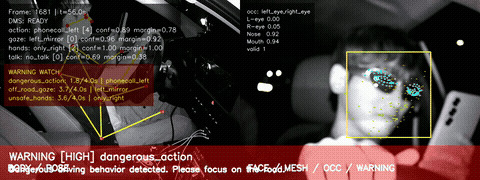
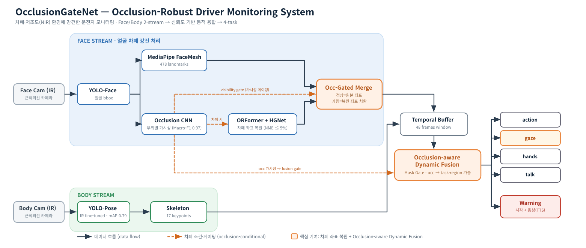
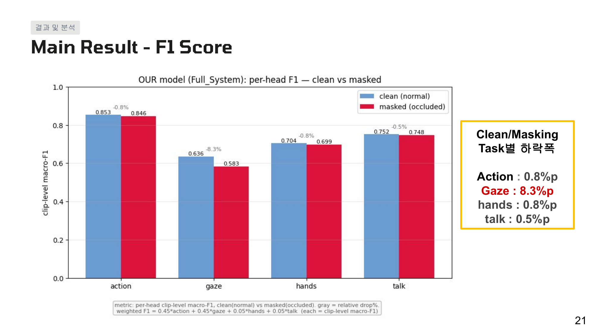
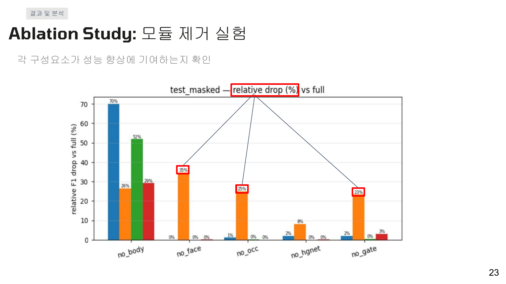
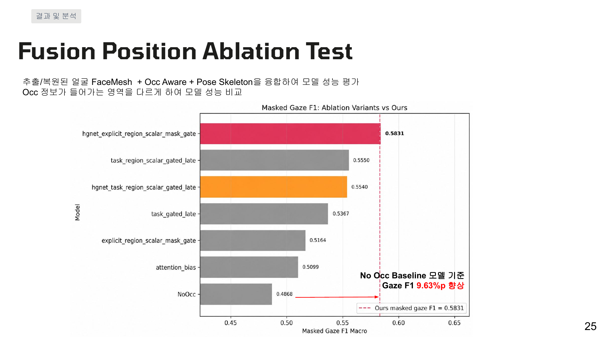
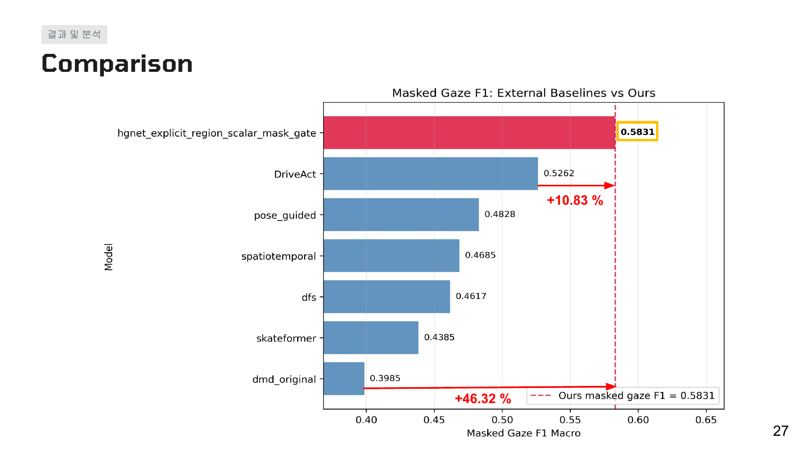
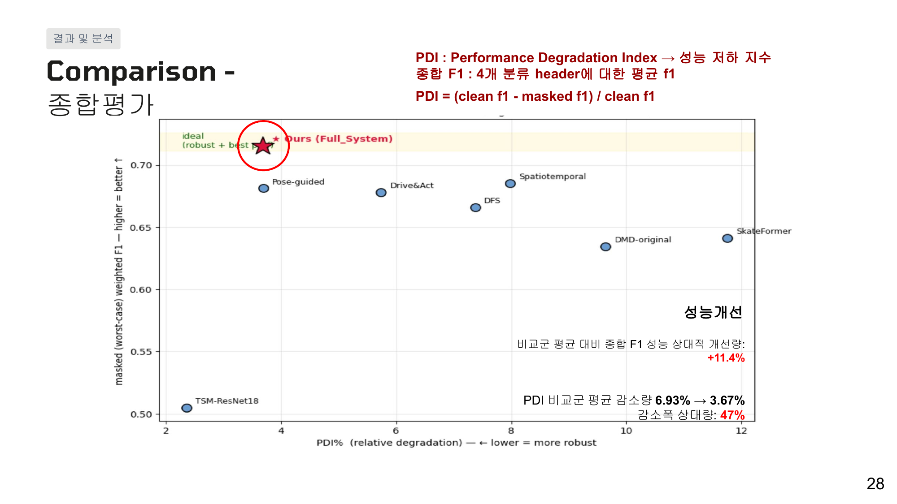
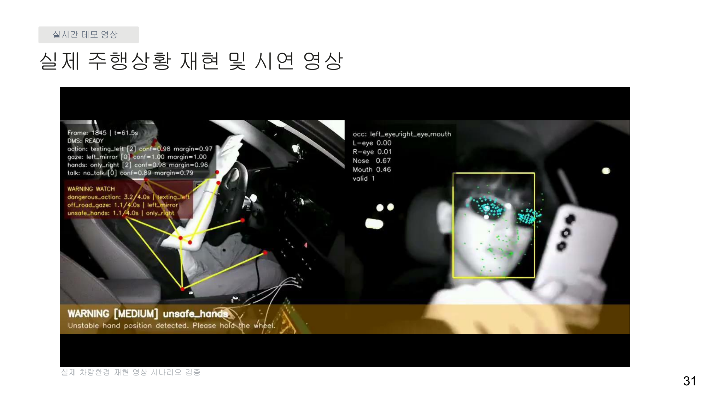

# OcclusionGateNet

**얼굴 차폐·저조도(NIR) 환경에도 강건한 운전자 모니터링 시스템 (Occlusion-Robust Driver Monitoring System)**

운전자의 얼굴이 **선글라스·마스크·손** 등으로 가려지거나 **야간 저조도** 상황에서도 운전자 상태(행동·시선·손·대화)를
안정적으로 분류하는 멀티태스크 DMS. 핵심은 *가려진 얼굴 영역의 랜드마크를 **ORFormer+HGNet**으로 복원하고,
단서별 가시성을 추정해 얼굴·자세 단서를 상황에 맞게 **동적으로 융합(Occlusion-aware Dynamic Fusion)***하는 데 있다.

> 세종대학교 인공지능학과 · 2026-1 캡스톤 디자인 · 팀 **스꾸삐(팀 01)** · 지도교수 이동훈
> 팀원: 유건(팀장) · 강성찬 · 황영인 · 이수찬 · 강민성



*영종도 야간 실도로 · 선글라스·마스크 차폐 상황 실시간 데모 — action/gaze/hands/talk 분류 + 부위별 차폐도 + 위험 경고 출력.*

---

## 핵심 결과 (한눈에)

- **차폐 상황에서도 강건**: clean→masked clip-level Macro-F1 하락폭이 action **0.8%p** / gaze **8.3%p** / hands **0.8%p** / talk **0.5%p** 로 작음.
- **외부 SOTA 비교군 대비 masked gaze F1 최고**: DriveAct 대비 **+10.83%**, 최저 비교군 대비 **+46.32%** (Ours 0.5831).
- **종합 강건성**: 비교군 평균 대비 종합 F1 **+11.4%**, 성능 저하 지수 **PDI 6.93% → 3.67% (≈47% 감소)**.
- **모듈 검증**: 차폐 판단 CNN Macro-F1 **0.9714**, 차폐 좌표 복원 NME **≤ 5%**(clean 대비), IR pose mAP50-95 **0.788**.

## 아키텍처



입력은 **Face/Body 2대의 근적외선(IR) 카메라**. 얼굴 스트림과 자세 스트림을 각각 처리한 뒤, 차폐 가시성에 따라
얼굴·자세 단서의 반영 비중을 동적으로 조정해 4개 task를 분류한다.

| 단계 | 모듈 (`full_system/full_dms_system/`) | 역할 |
|---|---|---|
| 얼굴 검출 | `YoloFaceBBoxExtractor` | YOLO-Face 얼굴 bbox (단일 얼굴 좌표 기준) |
| 얼굴 랜드마크 | `MediaPipeFaceMeshOnYoloCrop` | bbox crop → 478 landmarks |
| 차폐 판단 | `OccCNNRealtimeWrapper` | 부위별 가시성 추정 → `occ` (Macro-F1 0.97) |
| **랜드마크 복원** | `HGNetRestorer` | **ORFormer**(참조 heatmap) + **HGNet** → 가린 좌표 복원 |
| **차폐 게이팅 병합** | `OccGatedFaceMeshMerger` | 정상=원본 / 가림=복원 좌표 치환 |
| 자세 추출 | `YoloPoseSkeletonExtractor` | YOLO-Pose(IR FT) → skeleton 17점 |
| 시계열 누적 | `TemporalDMSBuffer` | 최근 48프레임 window |
| **동적 융합·분류** | `DMSClassifierWrapper` (+ `MultitaskClassifier`) | Occlusion-aware Dynamic Fusion(Mask Gate) → action/gaze/hands/talk |
| 경고 (데모) | `WarningStateMachine` (`scripts/`) | 위험 판단 → 시각+음성(TTS) 경고 |

## 핵심 기여 (3 pillars)

1. **NIR 도메인 적응** — 공개 데이터의 RGB 모델은 IR 차량 실내에서 불안정(RGB gaze 86.3% vs IR 76.8%). DMD NIR 1,000프레임을 직접 annotation 해 YOLO-Pose를 fine-tuning(mAP50-95 0.788).
2. **차폐 랜드마크 복원** — 가림으로 무너지는 FaceMesh를 **ORFormer + VQ-VAE + HGNet**으로 복원, clean 대비 NME 5% 이내 유지.
3. **Occlusion-aware Dynamic Fusion** — 부위별 가시성(occ CNN)을 task·region 단위 **Mask Gate**로 활용해 얼굴·자세 단서 비중을 동적 조정. No-Occ baseline 대비 masked gaze F1 **+9.63%p**.

## 결과 및 분석

### 1) 정량 성능 — clean vs masked (per-head clip-level Macro-F1)



| Task | clean | masked (occluded) | 하락폭 |
|---|---|---|---|
| action | 0.853 | 0.846 | 0.8%p |
| **gaze** | 0.636 | 0.583 | **8.3%p** |
| hands | 0.704 | 0.699 | 0.8%p |
| talk | 0.752 | 0.748 | 0.5%p |

가장 차폐에 민감한 gaze조차 큰 하락 없이 유지된다.

### 2) Ablation — 모듈 제거 & 융합 위치




- **모듈 제거**: 차폐 판단(occ)·gate 모듈 제거 시 gaze 성능이 크게 하락 → 두 모듈이 차폐 강건성의 핵심.
- **융합 위치**: 차폐 정보를 task 융합 단계에 적용했을 때 masked gaze F1 **0.5831** 로, No-Occ baseline(0.4868) 대비 **+9.63%p**.

### 3) 외부 비교군 대비 (masked gaze F1) & 종합 강건성(PDI)




| Model | masked gaze F1 | vs Ours |
|---|---|---|
| **Ours (OcclusionGateNet)** | **0.5831** | — |
| DriveAct | 0.5262 | +10.83% |
| pose_guided | 0.4828 | |
| spatiotemporal | 0.4685 | |
| dfs | 0.4617 | |
| skateformer | 0.4385 | |
| dmd_original | 0.3985 | +46.32% |

종합 F1은 비교군 평균 대비 +11.4%, PDI(성능 저하 지수)는 6.93%→3.67%로 약 47% 감소 — clean에서 높을 뿐 아니라 **차폐 시 저하를 효과적으로 억제**.

### 4) 실차 추론 데모



Arducam IR-Cut(B0506) 2대(Face/Body)를 차량에 설치, 영종도 야간 실도로에서 선글라스·마스크 차폐 시나리오를 촬영.
action/gaze/hands/talk 분류 + 부위별 차폐도를 오버레이하고 위험 행동 경고를 출력.

## 데이터셋

- **DMD (Driver Monitoring Dataset)** — 41h, 37 drivers, Face/Body/Hands × RGB/IR/Depth, 4-task(OpenLABEL annotation).
- **Masking 서브셋(자체 구축)** — 눈·입 등 주요 부위를 8종 appearance(blur/checker/noise/solid/stripe 등)로 인위 차폐해 차폐 학습·평가에 사용.

| Task | 입력 | 라벨 |
|---|---|---|
| Action | Face + Body | safe / phone_text / drink / reach / hair_makeup / talk_passenger / other |
| Gaze | Face 중심 | looking_road / not_looking_road |
| Hands | Body/Hands | both / right / left / none |
| Talk | Face 중심 | talking / not_talking |
| Occlusion | Face/Body/Hands | region별 visible / occluded |

## 저장소 구조

```
full_model/
├── landmark/            # ① ORFormer + HGNet 랜드마크 복원 (학습 코드)
├── classifier/          # ② 멀티태스크 분류기 코어 (OcclusionGateNet fusion 포함)
├── full_system/         # ★ 최종 통합 실시간 시스템 (영상 → end-to-end DMS)
│   ├── full_dms_system/ #   8 stage 런타임 모듈 + FullDMSSystem orchestrator
│   ├── configs/ scripts/ experiments/ notebooks/
├── pipeline/            # occgate 캐시 생성 · occ CNN 학습 등 재현 스크립트
├── models/              # 체크포인트 provenance (MODELS.md / PROVENANCE.md)
├── experiments/         # 연구 검증
│   ├── ablation/        #   occ 주입위치 · gaze 보조실험 · bootstrap 통계검증
│   ├── comparison/      #   외부 SOTA 비교군 (SkateFormer / SDA-TR / PO-GUISE)
│   └── legacy/          #   구 model4 결과(superseded)
└── docs/                # 보고서·발표자료·다이어그램(architecture.svg)
```

> `full_system/`이 최종 산출물이며, 학습 코어인 `classifier/`·`landmark/`를 그대로 재사용한다(중복 없음).

## 실행 (실시간 통합 시스템)

```bash
cd full_system
pip install -r requirements.txt
python scripts/run_video_pair.py \
  --config configs/full_dms_config_template.yaml \
  --face-video <face_ir.mp4> --body-video <body_ir.mp4> \
  --out-jsonl outputs/predictions.jsonl
```

체크포인트(`*.pt`)는 용량상 git 미추적 — `models/MODELS.md`의 출처/배치 안내 참조.

## 한계 및 향후 계획

- **Gaze 정밀도**: 랜드마크 기반이라 세밀한 시선 변화에 한계 → eye-crop·동공 특징 기반 gaze-specific branch 추가 예정.
- **복원 품질**: 강한 차폐·얼굴 검출 실패 시 복원 불안정 → 실차 차폐 데이터 확장, 신뢰도 기반 복원.
- **연산량**: 다중 모델 동시 구동 → 가지치기·양자화 경량화로 차량 탑재 최적화.

## 문서

- 최종 결과보고서: [`docs/final_report.pdf`](docs/final_report.pdf)
- 발표 자료: [`docs/presentation_slides.pdf`](docs/presentation_slides.pdf)
- 아키텍처 원본(벡터): [`docs/assets/architecture.svg`](docs/assets/architecture.svg)
</content>
