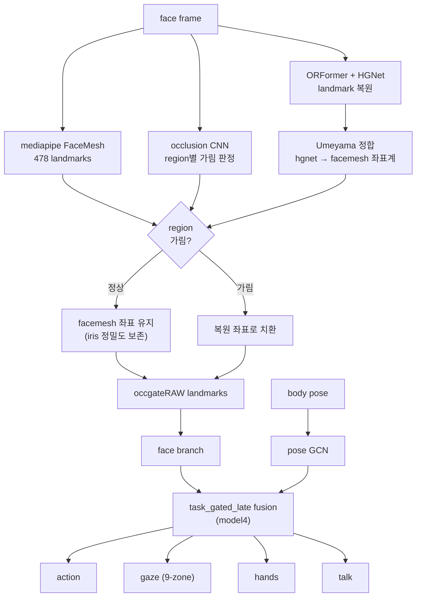

# Occlusion-Robust Driver Monitoring (model4 / model5)

DMD 운전자 모니터링용 **멀티태스크 분류 모델**(action·gaze·hands·talk) 와 그 입력을 가림(occlusion)에 강건하게 만드는
**랜드마크 복원 파이프라인**의 전체 구현. 핵심 기여는 *가려진 얼굴 영역의 좌표를 HGNet 으로 복원해 끼워넣는 occlusion-gated
face 입력(occgateRAW)* 으로, 가림 상황에서 gaze 성능 저하(PDI)를 크게 줄인다.

## 핵심 아이디어

얼굴 랜드마크 좌표만으로 gaze/action 을 분류하면 **가림(선글라스·마스크·패치)** 시 mediapipe facemesh 가 무너져 성능이 급락한다.
이를 막기 위해:

1. **정상 영역** → mediapipe facemesh 원본 좌표 (iris 정밀도 보존)
2. **가린 영역** → ORFormer+HGNet 으로 복원한 좌표를 facemesh 좌표계로 정합(Umeyama)해 치환
3. region 별 가림 여부는 **occlusion CNN** 또는 manifest GT 로 판정
4. 이렇게 만든 **occgateRAW** 좌표를 멀티태스크 분류기의 face branch 입력으로 사용

`model4` = `task_gated_late` fusion + occgateRAW. `model5` = `task_region_scalar_gated_late` fusion + fixedmask-finetuned HGNet 좌표.

## 저장소 구조

```
model4_dms/
├── classifier/        # 멀티태스크 DMS 분류기 (action/gaze/hands/talk)
│   ├── src/
│   │   ├── models/multitask_classifier.py   # 메인 모델 (pose GCN + face branch + fusion + 4 head)
│   │   ├── models/fusion/                    # occlusion-aware fusion 모듈들
│   │   │   ├── factory.py                    #   fusion kind 선택
│   │   │   ├── task_feature_fusion.py        #   task_gated_late      (model4)
│   │   │   ├── task_region_scalar_fusion.py  #   task_region_scalar_gated_late (model5)
│   │   │   ├── explicit_region_mask_gate.py / occ_attention_bias.py / occ_token_region_transformer.py
│   │   │   └── region_occ_utils.py
│   │   ├── data/        # dataset.py(window/npz_swap 로딩), clip_builder, window, fixed_manifest_split, preprocess_*
│   │   ├── training/    # train.py(엔트리), runner, loops, builders, aggregation
│   │   └── evaluation/  # v1_eval
│   ├── constants/       # gaze_zones(9-class), face_regions
│   ├── configs/         # base + fusion variants + generated/(model4·model5 yaml)
│   └── scripts/         # build_hgnet_cache_from_hyi_split.py 등
│
├── landmark/           # 랜드마크 복원 (ORFormer + StackedHGNet) — pretrain_v4
│   ├── src/models/      # StackedHGNet.py, VQVAE.py, simple_vit.py(ORFormer), quantizer.py
│   ├── src/data/        # dataset_dmd.py, heatmap_gen.py, augmentation.py, face_edge_info.py
│   ├── configs/         # default.py (DMD/DMD_68 cfg)
│   ├── scripts/         # train_phase{1,2,3}_*.py (codebook→ORFormer→HGNet 학습)
│   └── docs/            # METHOD_DIFF, TRAINING_LOG
│
├── pipeline/           # occlusion gating 파이프라인 + 실험 스크립트 (occ_cnn_v1)
│   ├── build_occgate_RAW_cache.py        # occgateRAW 좌표 캐시 (정상=facemesh / 가림=hgnet→facemesh)
│   ├── build_occgate_RAW_ft_cache.py     #   finetuned HGNet 버전 (model5)
│   ├── build_occgate_GT_cache.py         #   occgateGT (hgnet 좌표계 버전, 비교용)
│   ├── regen_hgnet478_ft_masked.py       # finetuned HGNet 으로 masked 좌표 재생성
│   ├── finetune_hgnet_fixedmask.py       # HGNet 을 8 appearance 가림으로 finetune
│   ├── train_occ_cnn.py                  # region occlusion CNN 학습 (TinyRegionCNN)
│   ├── verify_ft_nme.py / compare_orformer_vs_hgnet.py   # 랜드마크 NME 검증
│   ├── make_*_notebook.py                # 시각화 노트북 생성기
│   └── notebooks/                        # 결과 시각화 (gaze 사례, occlusion NME 진단)
│
├── full_system/        # ★ 실시간 통합(런타임) 시스템 — 영상 입력 → end-to-end DMS
    ├── full_dms_system/                  # 8 stage wrapper + FullDMSSystem orchestrator
    │   ├── yolo_pose_skeleton_extractor / yolo_face_bbox_extractor / mediapipe_facemesh_yolo
    │   ├── occ_cnn_realtime              # occ CNN 온라인 추론 → x_occ
    │   ├── hgnet_restorer                # ORFormer + HGNet 온라인 복원
    │   ├── occ_gate_merger / temporal_buffer(48f) / dms_classifier_wrapper
    │   └── full_system.py                # 전체 파이프라인 결합
    ├── configs/        # 런타임 템플릿 + DMS 분류기 config(체크포인트와 매칭)
    ├── scripts/        # run_video_pair / overlay / edge-TTS 경고음 / smoke test
    ├── experiments/retrain_ablation/     # leave-one-module-out 재학습 ablation
    └── notebooks/, outputs/(샘플)
│   # classifier/ · landmark/ 코드를 그대로 재사용(중복 없음). 체크포인트는 models/MODELS.md
│
└── experiments/        # 연구 검증(과정) — 코어와 분리
    ├── comparison/     #   외부 SOTA baseline 3종(SkateFormer/SDA-TR/PO-GUISE) 재구현
    ├── ablation/       #   occ 주입위치(AblationB)·gaze 보조실험·baseline 7종·bootstrap 통계검증
    └── legacy/         #   구 model4 결과(superseded) — 최종본 OcclusionGateNet 으로 대체
```

## 파이프라인 (end-to-end)

### 추론 파이프라인 (occlusion gating)



### 학습 / 캐시 생성 순서

```
[학습된 자산]  ORFormer(landmark/) + HGNet(landmark/) + occ CNN(pipeline/)
       │
       ▼
1) HGNet 좌표 캐시      classifier/scripts/build_hgnet_cache_from_hyi_split.py   → *_hgnet478.npz
2) occgateRAW 캐시      pipeline/build_occgate_RAW_cache.py                      → *_hgnet478_occgateRAW.npz
3) 분류기 학습          classifier/src/training/train.py --config <model4.yaml>
   (face npz_swap 으로 occgateRAW 좌표를 face branch 입력으로 로드)

[model5 추가 단계]
4) HGNet fixedmask finetune   pipeline/finetune_hgnet_fixedmask.py
5) 좌표 재생성 + occgateRAW_ft pipeline/regen_hgnet478_ft_masked.py → build_occgate_RAW_ft_cache.py
6) model5 학습                train.py --config <model5.yaml>
```

분류기 학습 실행 예:
```bash
cd classifier
PYTHONPATH=$(pwd):$(pwd)/configs python src/training/train.py \
  --config configs/generated/model4_occgateRAW_taskGated_occCNN_seed42.yaml
```

### 실시간 통합 시스템 (`full_system/`)

위 추론 파이프라인은 학습 시 **오프라인 캐시(npz)** 기반이다. `full_system/` 은 같은 구성요소를
**영상 한 쌍(face/body)에 대해 매 프레임 온라인으로** 돌리는 런타임이다 — ORFormer·HGNet·occ CNN 을
캐시가 아니라 직접 추론한다.

```
face_frame + body_frame
 ├─ body: YOLO-Pose → skeleton(17,2)
 └─ face: YOLO-face bbox → [ occ CNN(가시성) , MediaPipe FaceMesh(478) ]
          └─ 가림 region 있으면 → ORFormer→reference heatmap→HGNet 복원 → 가린 부위만 치환
 → 최근 48프레임 → Model4 분류기 → action / gaze / hands / talk
```

- 얼굴 분기가 실패해도(검출 실패 등) zero landmark + 중립 occ 로 **추론을 멈추지 않고** body 분기로 계속 진행.
- `classifier/` · `landmark/` 코드를 그대로 재사용하고, 체크포인트는 `models/MODELS.md` 참조.
- 실행: `python full_system/scripts/run_video_pair.py --config full_system/configs/full_dms_config_template.yaml --face-video ... --body-video ...`
- 상세는 [`full_system/README.md`](full_system/README.md).

### 비교군 · Ablation

- [`experiments/comparison/`](experiments/comparison/) — 우리 모델과 동일 프로토콜로 재구현한 외부 SOTA 비교군 3종
  (SkateFormer, SDA-TR Spatiotemporal, PO-GUISE Pose-guided). occlusion 신호 미사용이 핵심 대비점.
- [`experiments/ablation/`](experiments/ablation/) — occ 주입 위치 비교(`AblationB`), gaze 보조 ablation, baseline 7종(`Compare/`),
  그리고 n=5000 부트스트랩 통계검증(`bootstrap_4545`/`bootstrap_toolkit`) + 통합 평가(`Eval_Ablation`).
- [`experiments/legacy/`](experiments/legacy/) — 구 model4 결과(superseded). 최종본은 OcclusionGateNet(`full_system/`).

두 폴더 모두 `classifier/` 의 V5 구조를 fork 한 실험 스냅샷이며, 체크포인트·대용량 예측 덤프는 미추적(요약 결과만 포함).

## 주요 결과 (gaze head, clip-level macro-F1)

| 모델 | fusion | face 입력 | clean | masked | PDI |
|---|---|---|---|---|---|
| baseline (hgnet478 단순) | concat | hgnet 좌표 | ~0.475 | — | — |
| **model4** | task_gated_late | occgateRAW | **0.600** | **0.546** | +9.0% |
| hyi v5_task_gated_late | task_gated_late | mediapipe | 0.613 | 0.582 | +4.9% |
| hyi task_region_scalar (gaze045) | task_region_scalar_gated_late | mediapipe | 0.577 | 0.555 | +3.8% |
| **model5** (예정) | task_region_scalar_gated_late | occgateRAW_ft | TBD | TBD | TBD |

- PDI = (clean − masked) / clean × 100. 낮을수록 가림에 강건.
- occgateRAW 가 가림 부위 좌표를 HGNet 으로 복원해 masked gaze 와 robust 를 개선.

### 오분류 사례 시각화

가림(선글라스·마스크·노이즈/체커 패치)으로 facemesh 가 무너져 gaze zone 을 혼동하는 대표 사례.
`[X]` = 오분류, `occ le/re/mo` = 좌안/우안/입 region 가림도, `no landmark` = facemesh 검출 실패.


## 모델 가중치 (`models/` — 로컬 전용, git 미추적)

모든 모델은 `models/` 에 수집됨(occ CNN·ORFormer·codebook·HGNet phase3a/v2/v3·분류기·facemesh tflite, ~268M). 용량 때문에 .gitignore. 상세는 `models/README.md`. inference: `python pipeline/inference_demo.py --image face.png --occ`.

## 기타 외부 자산 (저장소·models 미포함)

대용량 자산은 git 에 넣지 않음(.gitignore). 재현 시 아래 경로/체크포인트 필요:

| 항목 | 경로 |
|---|---|
| ORFormer 라이브러리(vendor) | `/data/shared/orformer/vendor` (PYTHONPATH 추가) |
| ORFormer 가중치 | `pretrain_v4/artifacts/phase2_orformer_fixed/best.pt` |
| HGNet 가중치 (model4=**v3**) | `pretrain_v4/artifacts/phase3a_hgnet_478_v3/best.pt` |
| HGNet fixedmask finetune | `scuppy/yg/hgnet_fixedmask_ft/best.pt` |
| occ CNN (model4 occ_pred 생성) | **hyi** `/home/hyi/Code/Step9_extract_crop_npz/best.pt` (권한거부·미포함) |
| DMD 원본 영상/랜드마크 | `/data/shared/DMD`, `/data/shared/DMD_landmarks` |
| 가림 데이터셋 | `/data/shared/Occlusion_subset_dataset/region_occlusion_video_dataset_v3_original_fixedmask` |
| fixed split manifest | `/data/shared/scuppy/hyi/fixed_splits/dms_clean_masked_fixed_items_v1.json` |

> 코드 내 일부 절대경로는 위 자산을 가리킴. 다른 환경에서 재현 시 경로를 맞춰야 함.

## 데이터셋

DMD (Driver Monitoring Dataset) — distraction(action/gaze_weak/hands/talk) + gaze(s6, 9-zone fine) 세션.
subject-disjoint fixed split (clean/masked 1:1 paired). 가림은 6 zero-paint variant + fixedmask 8 appearance(solid/noise/checker/stripe/blur 등).

## 요구사항

`requirements.txt` 참조. 핵심: PyTorch, torchvision, OpenCV, mediapipe(facemesh GT), scikit-learn, matplotlib, PyYAML.
